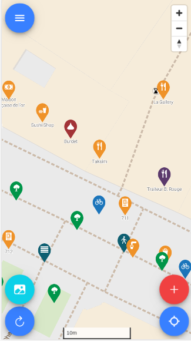
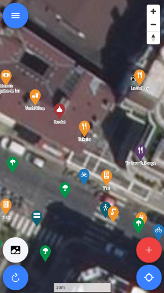
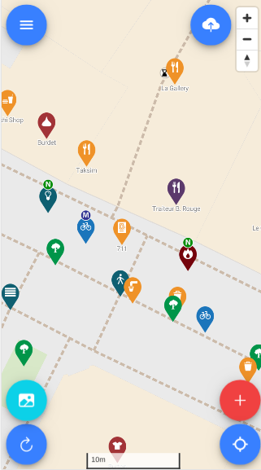

# Features
With OsmGo you can:
- Create/Update/Delete POI mapped as OpenStreetMap nodes
- Create/Update/Delete some way/area objects filtered to keep the most 'usefull' ones
- Use differents imageries: BDOrtho IGN, MapBox Satellite & Bing aerial imagery

# Interface

## Bottom buttons

1. Select an imagery
2. Download data in your area
3. Add an object
4. Show your location

Changing map backgroung from MapBox tiles to aerial imagery:

  
  

## Top right buttons

On the right upper screen there are three buttons:
- Zooming in
- Zooming out
- The last one toggles the the 'points always to the geographical north' functionality

## Three object types

  

Three different looking markers represent the three different objects we have in OpenStreetMap:

-  **Round** for an OSM **node**
-  **Hexagon** for an OSM **way**
-  **Square** for an OSM **area**

The area inside a polygon is clickable. The borders of the area represent the real objects' border.

## Menu

  

In the menu you have following options:

1. Tweak settings
2. About the map (version, etc.)
3. Connect / Disconnect with your OpenStreetMap account
4. Delete the data you've downloaded before.
5. Close the app

# POI View

A click of a marker opens the POI view. From here you can view or change tags, add new ones, etc.

  

This overview of the POI shows the name of the POI, changeset version, who edited last and when. It shows all tags in the OpenStreetMap database for this POI.

The buttons there enable you

1. to switch between a more human readable version of the data (button on the top right of the screen)
2. to close the POI view
3. to go into editing mode
4. This let you add the "survey_data" tag to let other mappers know that this POI has been checked at `<timestamp>`

# POI edit screen

  
  

  

## Copy/Paste tags

You can save attributes from an item and restore these attributes to an other item (with the same type):

1. Add or edit a POI
2. Add some tags
3. Click on the "copy/save" icon on top of screen
4. Add or edit a POI of the same type
5. Click on the "paste/load" icon on top of screen
6. All tags previouly copied will be applied to current POI

  

## Add a POI with 'not yet' supported type

You can add a key that does not exist in the database:

1. Add a POI
2. In the search bar, type `whatyouwant`
3. OsmGo! will propose you to create a POI amenity=whatyouwant, building=whatyouwant, etc.

  

# Upload your modifications as a changeset

  
  

